# Actividad - Tarea Evaluable Docker


> Módulo: Módulo Despliegue de Aplicaciones Web - CIFP La Laboral

> Realizado por David Fdez Vicente


| Contenedores | Imagenes    |
|----------|----------------|
|   PHP    | https://hub.docker.com/_/php |
|  MariaDB | https://hub.docker.com/_/mariadb |

### 1. Servidor web


##### Arranca un contenedor que ejecute una instancia de la imagen php:7.4-apache , que se llame web y que sea accesible desde un navegador en el puerto 8000.

> Creamos el contenedor cuya instancia de la imagen es php:7.4-apache y que tiene que ser accesible por el puerto 8000.

```sh
docker run -d --name web -p 8000:80 php:7.4-apache
```

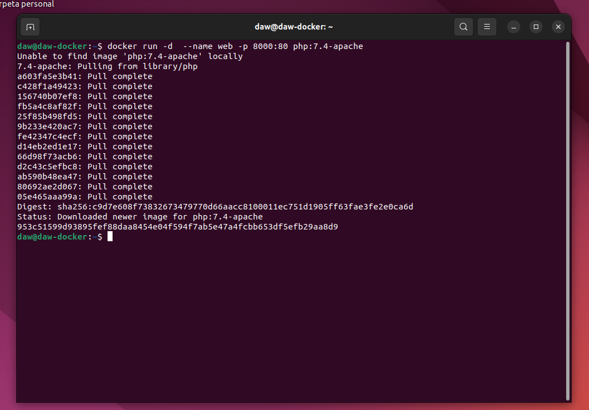

> Al ejecutar el anterior comando comporbamos que en el navegador nos salia el error 403 o el error Forbidden.

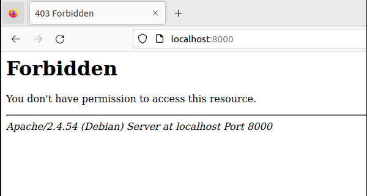

##### Colocar en el directorio raíz del servicio web ( /var/www/html ) un sitio web donde figure el nombre de los componentes del grupo.

> En este paso lo que hacemos es crear un fichero index.html en el directorio donde nos pedian y creamos una pagina basica con los nombres del componente del grupo.

```sh
docker exec -it web bash
nano index.html
cat index.html
```

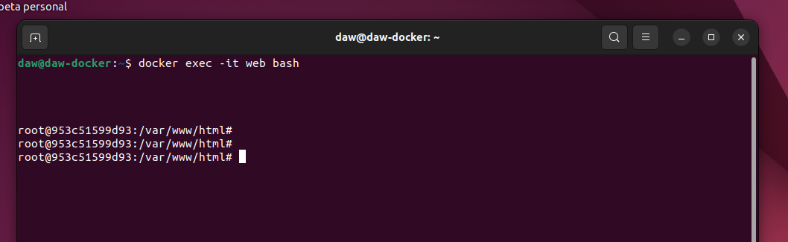

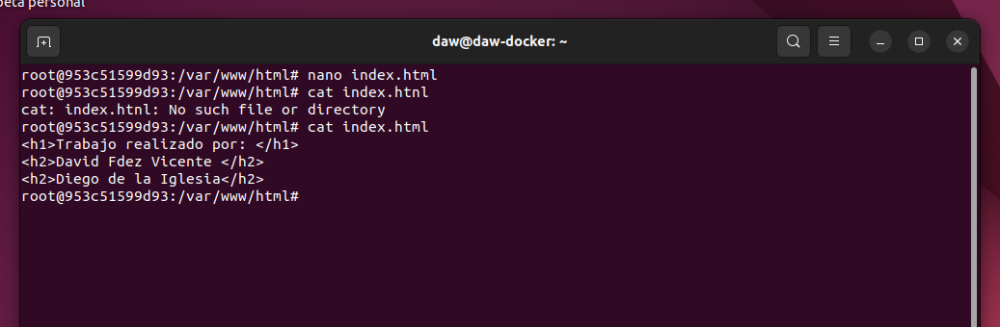

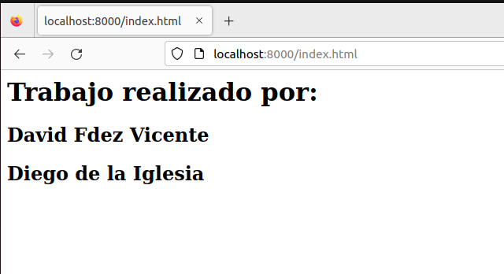

##### Colocar en ese mismo directorio raíz un archivo llamado mes.php que muestre el nombre del mes actual. Ver la salida del script en el navegador.

> Creamos el fichero mes.php en el mismo directorio que anteriormente habiamos creado el fichero index.html. En este fichero lo que hacemos es que nos muestre el nombre del mes actual.

```sh
docker exec -it web bash
nano mes.php
cat mes.php
```

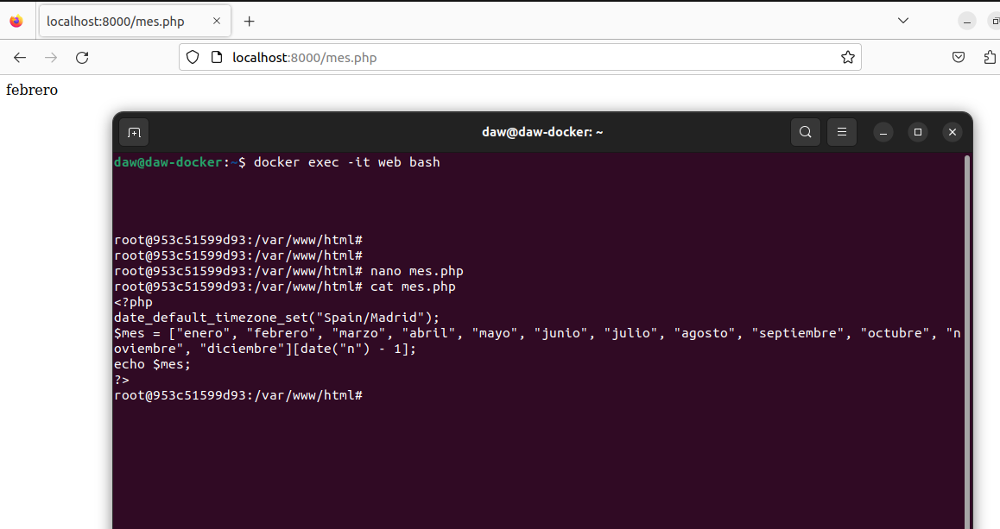

##### Borrar el contenedor.

> Borramos el contendor pero primero tenemos que mirar si esta en ejecucion, al estar en funcionamiento lo paramos y lo borramos junto con su imagen.

```sh
docker ps -a
docker stop web 
docker rm web
docker rmi php:7.4-apache
```

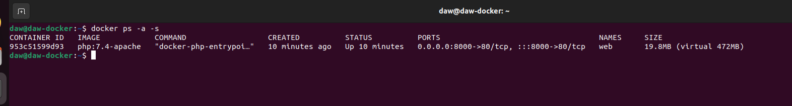

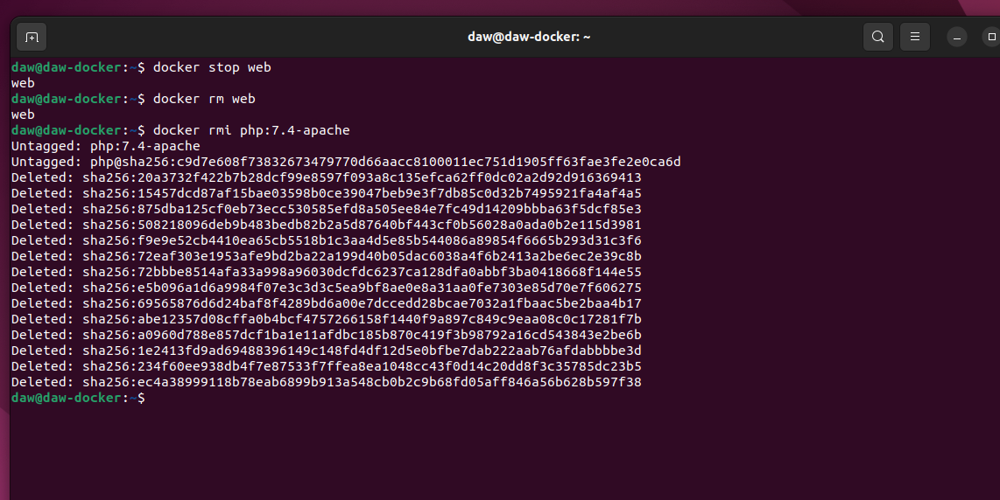

### 2. Servidor de base de datos

##### Arrancar un contenedor que se llame bbdd y que ejecute una instancia de la imagen mariadb para que sea accesible desde el puerto 3306.

> En este paso creamos un contendor que se llame bbdd y que se ejecute la imagen de mariaDB y que además sea accesible por el puerto 3306.

```sh
mkdir my_init_bd
echo "GRANT ALL PRIVILEGES ON *.* TO INVITADO;" > my_init_db/my_grants.sql

docker run -d --name bbdd -e MYSQL_ROOT_PASSWORD=root -e MYSQL_USER=invitado -e MYSQL_PASSWORD=invitado -e MYSQL_DATABASE=prueba -p 3306:3306 -v $PWD/my_init_db:/docker-entrypoint-initdb.d mariadb
```

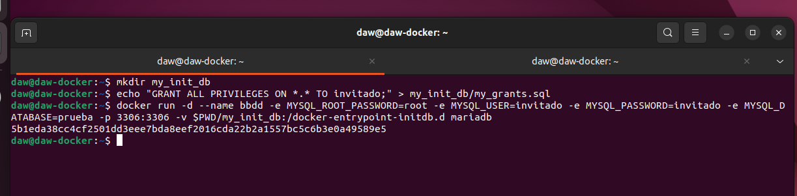


##### Antes de arrancarlo visitar la página del contenedor en Docker Hub y establecer las variables de entorno necesarias para que:

   * La contraseña de root sea root.
   * Crear una base de datos automáticamente al arrancar que se llame prueba.
   * Crear el usuario invitado con la contraseña invitado.
   
   ```sh
   docker run -it --name cliente_bbdd --link bbdd:bbdd mysql mysql -hbbdd -uinvitado -pinvitado
   
   show databases
   ```
   
   > Tenemos que crear un cliente de base de datos para poder conectarnos al servidor de base de datos con el usuario creado y ver la tabla que se ha creado
   
   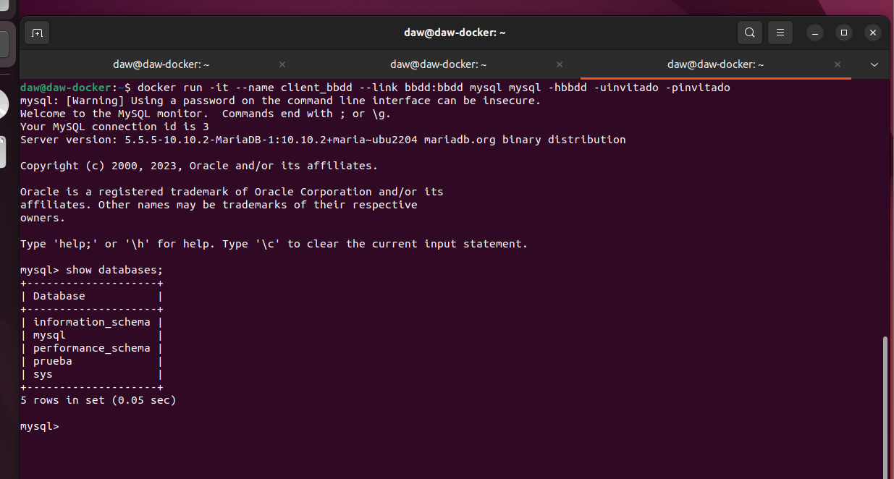
   
   > Y por ultimo comprobamos que no se puede borrar la imagen mariadb mientras el contenedor esta en ejecucion.
   
   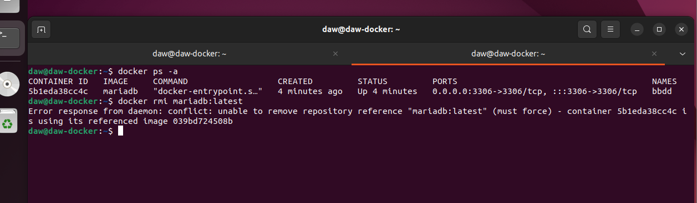