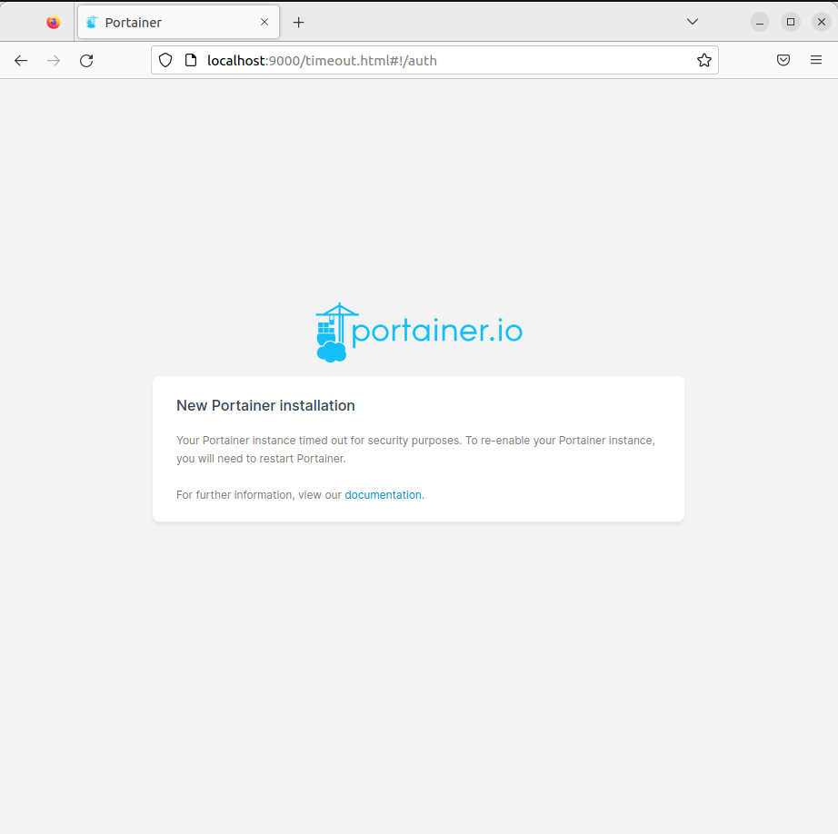
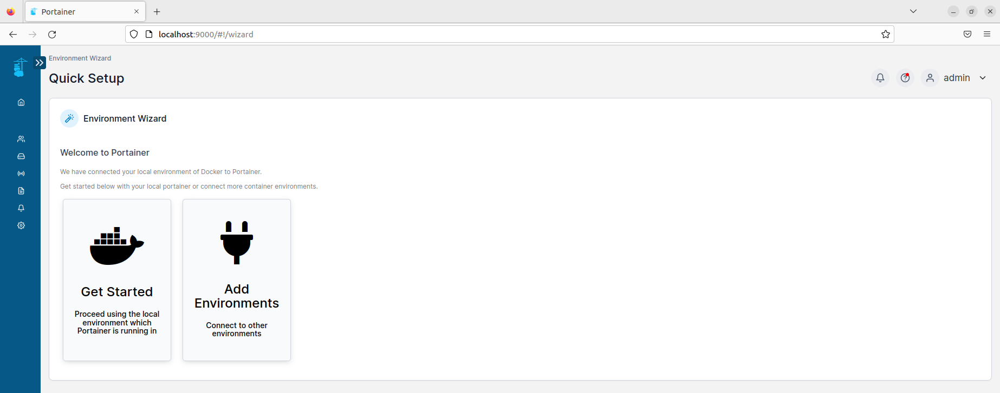
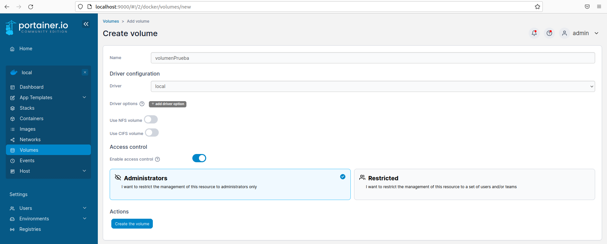

# Ejercicio 2 - almacenamiento - Portainer

> Módulo: Módulo Despliegue de Aplicaciones Web - CIFP La Laboral

> Realizado por Diego de la Iglesia Rodríguez

##### Lo primero es crear un directorio para almacenar el docker-compose con el siguiente contenido. (Si no creamos el docker-compose, al intentar acceder nos pedirá una licencia)

##### Ejecutamos el siguiente comando

##### Accedemos mediante "localhost:9000/"

##### Muestra contenedores activos, para un contenedor, borra un contenedor

##### Muestra alguna operación con redes Docker: 
> eliminamos una gran cantidad de redes.

##### Muestra alguna operación con volúmenes Docker
> Eliminamos volumenes.

> Creamos un volumen nuevo.

