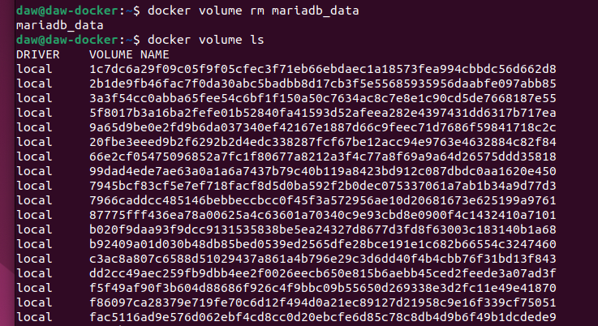

# Actividad - Tarea Evaluable Docker

> Módulo: Módulo Despliegue de Aplicaciones Web - CIFP La Laboral

> Realizado por David Fdez Vicente

| Contenedores      | Imagenes       |
|----------------|----------------|
| MariaDB	 | https://hub.docker.com/_/mariadb|
| Adminer	 | https://hub.docker.com/_/adminer|


## Ejercicio 3 - Redes

##### 1. Crea una red bridge redb.
     
 > Lo primero que hacemos es la creacion de la red bridge llamada 'redbd'
     
 ```sh
 docker network create redbd
 ```

 
    

##### 2. Crea un contenedor con una imagen de mariaDB que estará en la red redbd . Este contenedor se ejecutará en segundo plano, y será accesible a través del puerto 3306. (Es necesario definir la contraseña del usuario root y un volumen de datos persistente).
   
> Creamos un contenedor para la imagen mariaBD que estara en la red creada anteriormente. Este contenedor va a estar en segundo plano por lo que se añade el comando -d y estara en el puerto -p 3306:3306.
   
 ```sh
docker run -d --name mariadb -e MYSQL_ROOT_PASSWORD=root -p 3306:3306 --network redbd -v mariadb_data:/var/lib/mysql mariadb
   ```
   
 
   
##### 3. Crear un contenedor con Adminer que se pueda conectar al contenedor de la BD.

> Creamos un contenedor para la imagen adminer que estara en la red creada anteriormente. Este contenedor va a estar enlazado al contendor de mariadb.
   
 ```sh
docker run --name adminer-db --link mariadb:mariadb -p 8080:8080 --network redbd -d adminer 
```
   


##### 4. Comprobar que el contenedor Adminer puede conectar con el contenedor mysql abriendo un navegador web y accediendo a la URL: http://localhost:8080.

```sh
http://localhost:8080.
```


> En la siguiente captura se ve la ejecucion de los dos contenedores.


> En esta otra, se muestra el acceso a la BD a traves de la interfaz de adminer.


> En esta otra, se crea un BD en la interfaz de adminer.


> Entramos en la consola del servidor web y comprobamos que se ha creado la BD.


> Paramos los contenedores en ejecucion y borramos tanto las imagenes como los volumenes utilizados.





  
  
 
  
  
  
  
