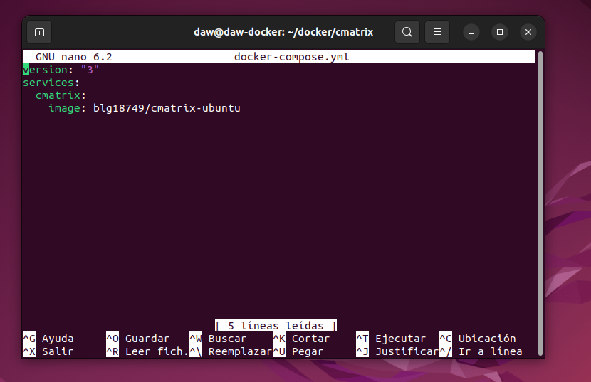
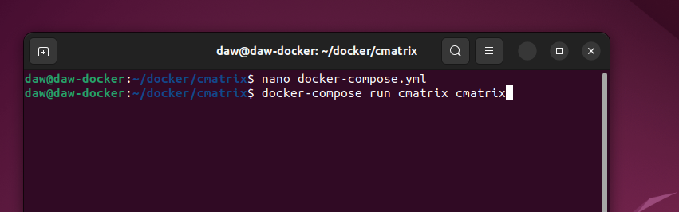
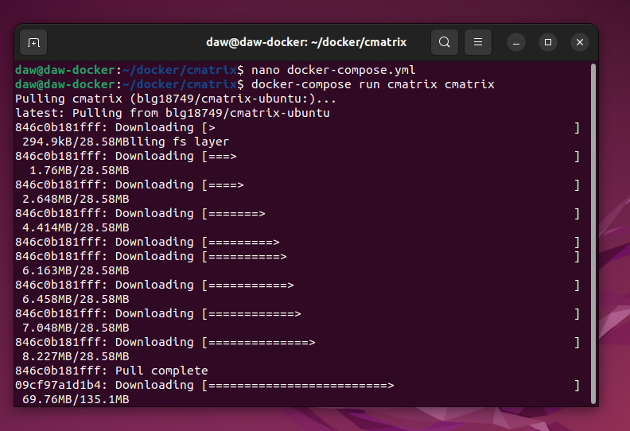
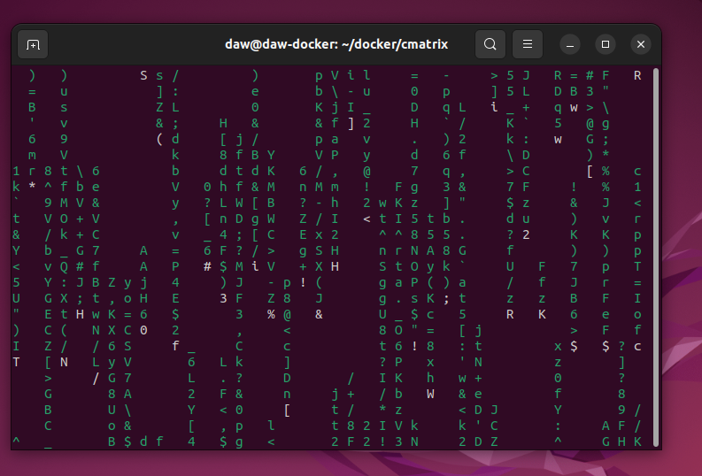

# Actividad - Tarea Evaluable Docker

> Módulo: Módulo Despliegue de Aplicaciones Web - CIFP La Laboral

> Realizado por David Fdez Vicente

| Contenedores      | Imagenes       |
|-------------------|----------------|
| Cmatrix	       | https://hub.docker.com/r/blg18749/cmatrix-ubuntu |

## Ejercicio 4 - Docker Compose

##### 1. Desplegar la aplicacion cmatrix utilizando docker-compose.

> Creamos la estructura de directorio del ejercicio ademas de crear un fichero docker-compose.yml para luego ejecutarlo en la terminal y que se ejecute la aplicacion.

```sh
mkdir docker/cmatrix
cd docker/cmatrix
nano docker-compose.yml
```





> Ejecucion de la aplicacion cmatrix



> Resultado final de la aplicacion cmatrix y del efecto Greenrain



##### 2. Explicar brevemente cómo funciona esta aplicación.

> Esta aplicacion es un programa que muestra una serie de caracteres/letras al estilo 'The Matrix'. Ademas puedes personalizarlo con diferentes colores y de diferentes velociadades.