# Ejercicio 5 - imagen con Dockerfile

> Módulo: Módulo Despliegue de Aplicaciones Web - CIFP La Laboral

> Realizado por Diego de la Iglesia Rodríguez

##### Creamos un directorio

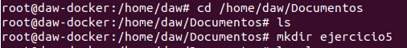

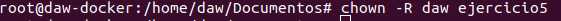

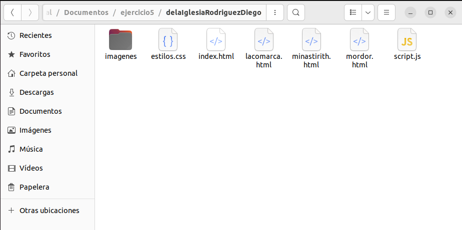

##### Creamos el fichero Dockerfile

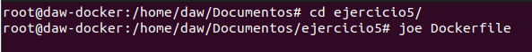

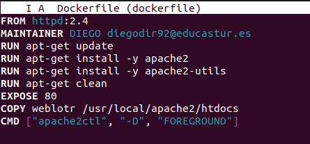

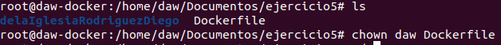

##### Creamos la imagen

```shh
docker build -t webapache .
```

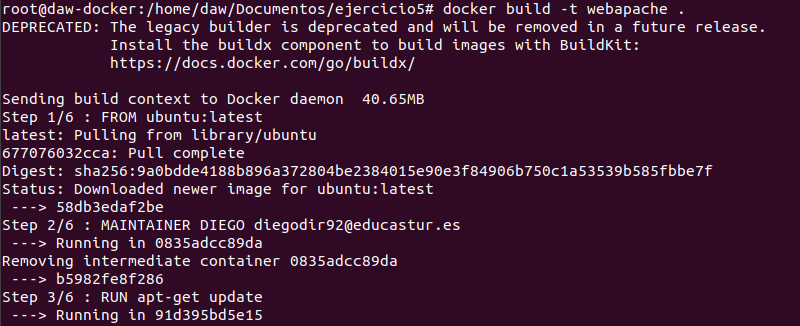

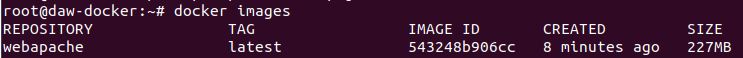

##### Probamos la imagen en un contenedor

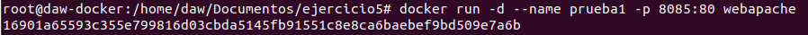

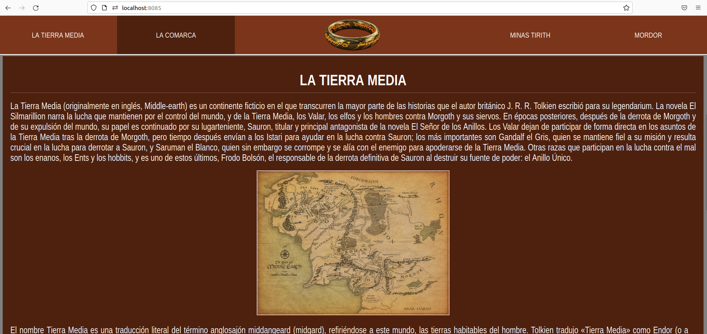

##### Subimos la imagen a dockerhub

```shh
docker tag webapache diegodir92/webapache:latest

docker login

docker push diegodir92/webapache
```

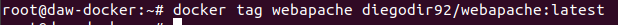

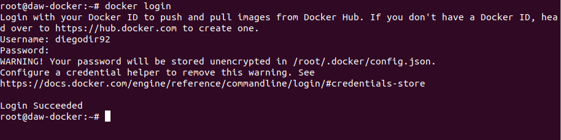

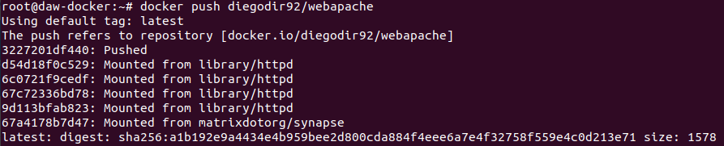

##### David descarga la imagen de docker y la prueba 


